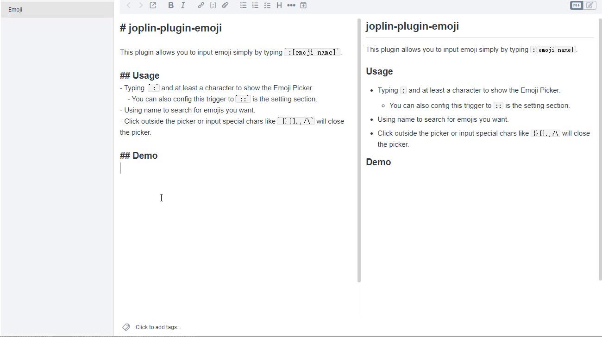
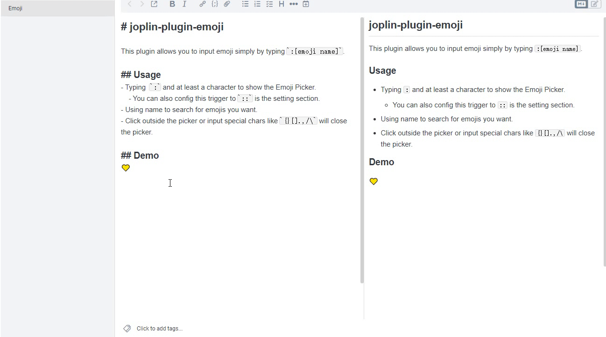

# joplin-plugin-emoji

This plugin allows you to input emoji simply by typing `:[emoji name]` or `::[emoji name]`.

## Usage

- Typing `:` and at least a character to show the Emoji Picker
  - You can also switch the trigger to `::` in settings
- Using name to search for emojis you want.
- Click outside the picker or input special chars like `{}[].,/\` will close the picker.

## Demo

The repository is here: https://github.com/Retr0ve/joplin-plugin-emoji

If there are any bugs or suggestions, please leave a comment or open an issue to let me know, thanks.
