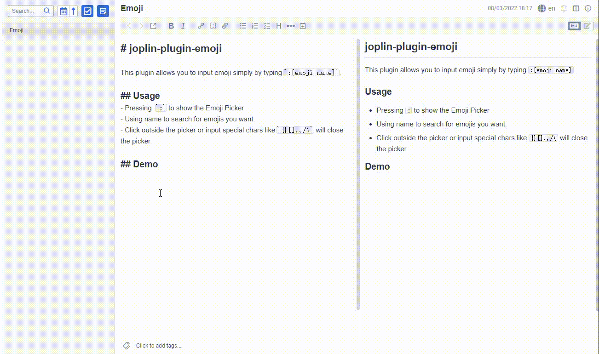

# joplin-plugin-emoji

This plugin allows you to input emoji simply by typing `:[emoji name]`.

## Usage
- Pressing  `:` to show the Emoji Picker
- Using name to search for emojis you want.
- Click outside the picker or input special chars like `{}[].,/\` will close the picker.

## Demo

The repository is here: https://github.com/Retr0ve/joplin-plugin-emoji

If there are any bugs, please open an issue and let me know, thanks.

